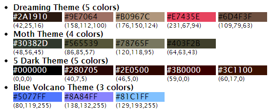

# jsRazor - simpler and more powerful client-side rendering

jsRazor is a cutting edge client-side templating plugin that shaves off all complexity that other (DOM-based, MVC, JS compiled template, etc) frameworks have. It delivers simpler, faster, and much more flexible solution allowing every HTML graphics designer to do expert-level page rendering.

The idea behind jsRazor is simple: every possible output can be achieved as a random combination of only TWO functional primitives: 1) repeat - to repeat the fragment, and 2) toggle - to show/hide the fragment. We don't need anything else to get the desired output.

Why jsRazor is good?
- The most trivial and intuitive approach to template rendering
- Full separation of HTML template and JavaScript controller code
- String-based processing only, super fast, no DOM, no JS compilation, no RegEx parsing
- Absolutely generic output, no limitation at all
- Tiny and lightweight, about 100 lines of code

## Documentation

All you need to know about jsRazor is here: [jsRazor Documentation](http://www.makeitsoft.com/jsrazor/jzrazor-docs/ "jsRazor Documentation")

## Installation and Usage

Include library link in the HEAD section of your page: 

``` html
<script src="/path/to/jquery.jsrazor.js"></script>
```

jsRazor does not use jQuery or anything else - it's completely standalone. However, if jQuery is used on the page, then jsRazor should be called using plugin syntax (this is just because I love jQuery):

``` javascript
// with jQuery
$.jsrazor.repeat(..)
$.jsrazor.toggle(..)
// without jQuery
jsrazor.repeat(..)
jsrazor.toggle(..)
``` 

## Quick Example

Assume we have some JSON describing themes and colors:

``` javascript
var data_Themes =
[
  { name: "Dreaming Theme", colors: ["#2A1910", "#9E7064", "#B0967C", "#E7435E", "#6D4F3F"] },
  { name: "Moth Theme", colors: ["#30382D", "#565539", "#78765F", "#403F2B"] },
  { name: "5 Dark Theme", colors: ["#000000", "#280705", "#2E0500", "#3B0000", "#3C1100"] },
  { name: "Blue Volcano Theme", colors: ["#5077FF", "#8A84FF", "#81C1FF"] }
];
```

Assume we want to render the following UI based on this JSON: 



First, we create HTML template:

``` html
<div id="example">
  <ul>
    <!--repeatfrom:themes-->
    <li> 
      <div class="name">{name} ({CountColors} colors)</div>
      <!--repeatfrom:colors-->
      <div class="wrap">
        <div class="color" style="background-color:{item};">
          <!--showfrom:dark-->
          <span style="color:white">{item}</span>
          <!--showstop:dark-->
          <!--showfrom:light-->
          <span style="color:black">{item}</span>
          <!--showstop:light-->
        </div>
        <div class="rgb">({R},{G},{B})</div>
      </div>
      <!--repeatstop:colors-->
    </li>  
    <!--repeatstop:themes-->
  </ul>
</div>
```

Second, we create JavaScript controller code:

``` javascript
// get initial template
var tmp = document.getElementById("example").innerHTML; 
// repeat theme objects (pass array of themes to repeat functional)
tmp = $.jsrazor.repeat(tmp, "themes", data_Themes, function (tmp, idx, item)
{
  // repeat inner color objects (pass array of colors of the current theme item)
  tmp = $.jsrazor.repeat(tmp, "colors", item.colors, function (tmp, idx, item)
  {
    // use toggle to show dark or light color text (to be contrast with background)
    tmp = $.jsrazor.toggle(tmp, "dark", hex2rgb(item).mid <= 128);
    tmp = $.jsrazor.toggle(tmp, "light", hex2rgb(item).mid > 128);
    // output RGB representation of the color as custom value
    tmp = tmp
      .replace("{R}", hex2rgb(item).r)  // red
      .replace("{G}", hex2rgb(item).g)  // green
      .replace("{B}", hex2rgb(item).b); // blue
    // return processed template for current INNER item
    return tmp;
  });
  // color counter is not a part of JSON, so we output it as custom value
  tmp = tmp.replace("{CountColors}", item.colors.length);
  // return processed template for current item
  return tmp;
});
// put processed output back
document.getElementById("example").innerHTML = tmp;
```

We're done! 

## License and Copyright

Copyright (c) 2013 Roman Gubarenko

The jsRazor library is licensed under the [MIT](MIT-LICENSE.txt "MIT License Link") license.

You are free to use the jsRazor in commercial projects as long as the copyright header is left intact.

## Authors

[Roman Gubarenko] (https://github.com/rgubarenko)
